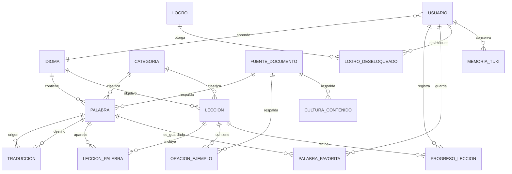
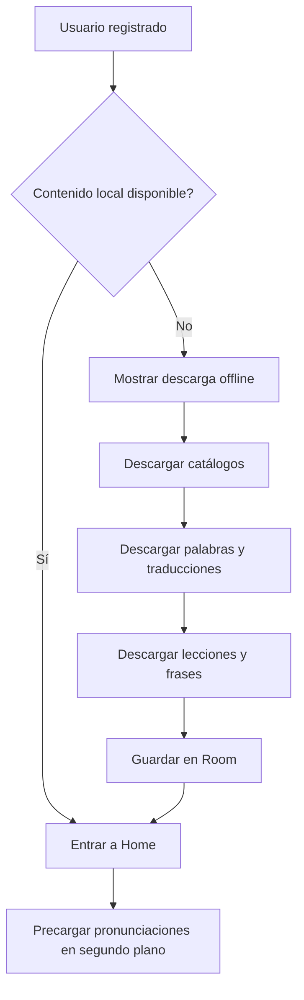
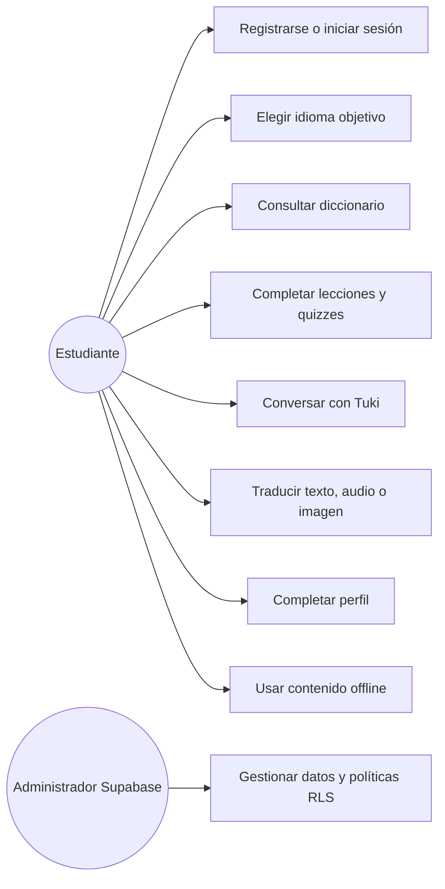
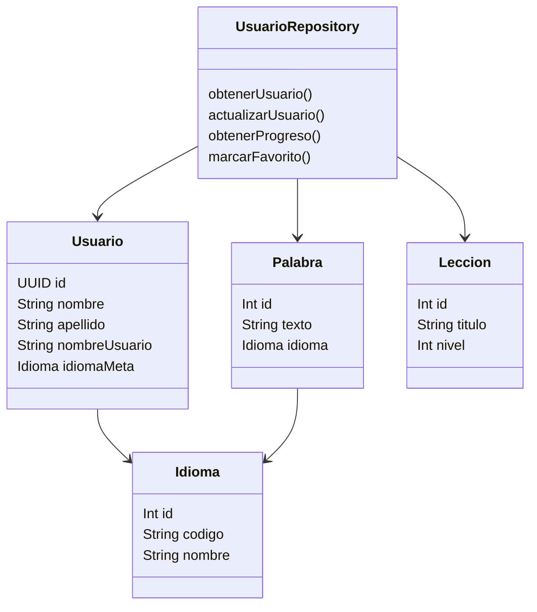

# Aikukisna

Aplicación móvil Android para el aprendizaje de idiomas, dirigida especialmente a estudiantes de zonas rurales. Incluye lecciones, diccionario, traducción, pronunciación, reconocimiento de voz e imágenes, tutoría con IA, contenido cultural y funcionamiento offline.

## 1. README Técnico

### 1.1 Arquitectura

El proyecto utiliza Clean Architecture, MVVM, Jetpack Compose y Hilt:

```text
Compose Screen
    -> ViewModel
    -> UseCase
    -> Repository interface
    -> Repository implementation
    -> Supabase / Room / servicios externos
```

```text
app/src/main/java/com/aikukisna/app/
├── data/
│   ├── auth/        Google Sign-In y autenticación.
│   ├── local/       Room, DAOs, cache offline y modelos locales.
│   ├── remote/dto/  DTOs serializables de Supabase.
│   └── repository/  Implementaciones de repositorios.
├── domain/
│   ├── model/       Modelos de negocio.
│   ├── repository/  Contratos de datos.
│   └── usecase/     Reglas y operaciones de negocio.
├── di/              Módulos de inyección Hilt.
├── presentacion/
│   ├── componentes/ Componentes Compose reutilizables.
│   ├── navegacion/  Rutas y grafo de navegación.
│   ├── pantallas/   Pantallas, estados y previews.
│   └── viewmodel/   Estado y eventos de cada pantalla.
└── ui/theme/        Colores, tipografías y tema claro/oscuro.
```

### 1.2 Dependencias

| Dependencia | Versión o uso |
|---|---|
| Android Gradle Plugin | 9.2.1 |
| Kotlin | 2.2.10 |
| Kotlin Symbol Processing | 2.2.10-2.0.2 |
| Jetpack Compose | BOM 2026.02.01 |
| Material 3 | Interfaz y componentes visuales |
| Navigation Compose | 2.9.8 |
| Hilt | 2.60.1 |
| Room | 2.8.4 |
| Supabase Kotlin BOM | 3.6.0 |
| Ktor OkHttp | 3.5.0 |
| CameraX | 1.5.3 |
| Google Credentials | 1.5.0 |
| ML Kit Text Recognition | 16.0.1 |
| ML Kit Image Labeling | 17.0.9 |
| Vosk Android | 0.3.47 |
| JUnit | 4.13.2 |

La fuente de verdad de las versiones es `gradle/libs.versions.toml`.

### 1.3 Variables de entorno

Android utiliza `local.properties`, no un archivo `.env`. No se deben subir claves al repositorio.

```properties
sdk.dir=<RUTA_DEL_ANDROID_SDK>
SUPABASE_URL=https://<project-ref>.supabase.co
SUPABASE_ANON_KEY=<CLAVE_PUBLICA_SUPABASE>
GEMINI_API_KEY=<CLAVE_GEMINI>
ELEVENLABS_API_KEY=<CLAVE_ELEVENLABS>
GOOGLE_WEB_CLIENT_ID=<CLIENT_ID_WEB_GOOGLE>

# Solo para builds release firmados
KEYSTORE_FILE=<RUTA_AL_KEYSTORE>
KEYSTORE_PASSWORD=<PASSWORD_DEL_KEYSTORE>
KEY_ALIAS=<ALIAS_DEL_KEYSTORE>
KEY_PASSWORD=<PASSWORD_DE_LA_CLAVE>
```

`app/build.gradle.kts` lee estas propiedades y las expone mediante `BuildConfig`. La plantilla está en `local.properties.example`.

### 1.4 Estructura modular

La aplicación usa un módulo Android principal (`app`), dividido internamente por responsabilidades:

| Módulo interno | Responsabilidad |
|---|---|
| `domain/model` | Entidades y modelos independientes de Android |
| `domain/repository` | Interfaces que consume el dominio |
| `domain/usecase` | Casos de uso de autenticación, aprendizaje, IA y offline |
| `data/local` | Room, cache, sincronización y procesamiento local |
| `data/remote/dto` | Modelos de respuesta e inserción de Supabase |
| `data/repository` | Acceso concreto a Supabase y cache local |
| `presentacion/pantallas` | Interfaces Compose y previews |
| `presentacion/viewmodel` | Estado, validaciones y eventos de UI |
| `presentacion/navegacion` | Rutas, navegación autenticada y barra inferior |
| `ui/theme` | Tipografías, colores y modo oscuro |

### 1.5 Scripts y ejemplos de endpoints

Scripts demostrables desde la raíz del proyecto:

```powershell
.\scripts\verify-environment.ps1  # Valida variables requeridas
.\scripts\verify-build.ps1       # Ejecuta pruebas y genera APK debug
.\scripts\test-endpoints.ps1     # Imprime respuestas reales de Supabase
.\scripts\demo-endpoints.ps1     # Guarda evidencias JSON
.\scripts\verify-supabase.ps1    # Comprueba tablas y conexión
.\scripts\deploy-release.ps1     # Genera APK release
```

Ejemplo de consulta al diccionario:

```http
GET https://<project-ref>.supabase.co/rest/v1/palabra?select=*,idioma(*),categoria(*),fuente_documento(*)&idioma_id=eq.1&order=texto.asc&limit=50
apikey: <SUPABASE_ANON_KEY>
Authorization: Bearer <JWT_DE_SUPABASE_AUTH>
```

Ejemplo de consulta al perfil autenticado:

```http
GET https://<project-ref>.supabase.co/rest/v1/usuario?select=*,idioma_meta:idioma_meta_id(*)&id=eq.<USER_UUID>
apikey: <SUPABASE_ANON_KEY>
Authorization: Bearer <JWT_DE_SUPABASE_AUTH>
```

Ejemplo de RPC para completar una lección:

```http
POST https://<project-ref>.supabase.co/rest/v1/rpc/completar_leccion
apikey: <SUPABASE_ANON_KEY>
Authorization: Bearer <JWT_DE_SUPABASE_AUTH>
Content-Type: application/json

{"p_leccion_id":12,"p_puntaje":8}
```

Ejemplo de Edge Function para Tuki:

```http
POST https://<project-ref>.supabase.co/functions/v1/gemini-proxy
Authorization: Bearer <SUPABASE_ANON_KEY>
Content-Type: application/json

{"prompt":"Explícame esta palabra con un ejemplo sencillo","contexto":"La persona está aprendiendo Miskito"}
```

Ejemplo de generación de pronunciación:

```http
POST https://<project-ref>.supabase.co/functions/v1/sintetizar-voz
Authorization: Bearer <SUPABASE_ANON_KEY>
Content-Type: application/json

{"texto":"Aisabe","voiceId":"<VOICE_ID_OPCIONAL>"}
```

Los scripts `test-endpoints.ps1` y `demo-endpoints.ps1` permiten demostrar las respuestas reales sin guardar secretos en el código.

## 2. Diagramación de Base de Datos

### 2.1 Modelo normalizado en tercera forma normal

La base principal utiliza PostgreSQL mediante Supabase. Las entidades se separan para evitar duplicación de información y las relaciones se realizan mediante claves foráneas.

Entidades principales:

- `idioma`
- `categoria`
- `fuente_documento`
- `palabra`
- `traduccion`
- `leccion`
- `leccion_palabra`
- `oracion_ejemplo`
- `usuario`
- `progreso_leccion`
- `palabra_favorita`
- `logro`
- `logro_desbloqueado`
- `memoria_tuki`
- `cultura_contenido`

El esquema SQL definitivo y las políticas RLS viven actualmente en el proyecto Supabase. El repositorio contiene los DTO, repositorios, entidades Room y consultas que consumen este esquema.

### 2.2 Relaciones principales



### 2.3 Diagrama de actividades: descarga offline



### 2.4 Diagrama de casos de uso



### 2.5 Diagrama de clases simplificado



## 3. Interfaz y Desarrollo

### 3.1 Interfaces navegables

La navegación está centralizada en `GrafoNavegacion.kt`. Las pantallas autenticadas utilizan `PantallaAutenticadaConNavBar`, que mantiene visible la barra inferior en Home, Aprender, Diccionario y Perfil.

Flujo principal:

```text
Splash -> Onboarding -> Login/Registro -> Selección de idioma -> Descarga -> Home
```

Funcionalidades accesibles desde la aplicación:

- Home y progreso del estudiante.
- Mapa de lecciones y quizzes.
- Diccionario del idioma seleccionado.
- Traductor de texto, audio e imágenes.
- Cámara para OCR y reconocimiento de objetos.
- Tuki, tutor conversacional.
- Perfil, logros, favoritos, cultura y configuración.

### 3.2 Validación de formularios

- Login: valida identificador y contraseña no vacíos.
- Registro: valida nombres, nombre de usuario, correo, contraseña e idioma.
- Recuperación de contraseña: valida correo y muestra el estado de la solicitud.
- Completar perfil: valida nombres, apellidos y nombre de usuario.
- Selección de idioma: exige una opción antes de continuar.
- Las respuestas de red muestran errores controlados sin exponer claves ni tokens.

### 3.3 Estructura visual responsive

- Las pantallas usan `fillMaxSize`, `fillMaxWidth`, `verticalScroll` y `LazyColumn` para adaptarse a distintos tamaños.
- Se aplican `statusBarsPadding` y `navigationBarsPadding` para evitar que títulos y botones queden debajo de las barras del sistema.
- Las pantallas nuevas incluyen `@Preview` para validar estados visuales sin ejecutar autenticación.
- La tipografía y los colores se centralizan en `ui/theme`.
- El modo oscuro usa superficies y colores de texto contrastantes, evitando texto blanco sobre tarjetas blancas.
- Los estados de carga, error, sin resultados y contenido se representan por separado.

### 3.4 Diseño y componentes

Los componentes reutilizables incluyen:

- `AikukisnaButton`.
- `AikukisnaTextField`.
- `NavBar`.
- Tarjetas de contenido y lección.
- Selectores de idioma.
- Indicadores de progreso.
- Previews claros y oscuros.

## 4. Control de Versiones

### 4.1 Flujo profesional de ramas

Se recomienda trabajar con ramas separadas del código estable:

```text
main
  └── codex/nombre-de-la-tarea
          └── Pull Request -> revisión -> pruebas -> merge
```

Tipos de ramas sugeridos:

- `main`: versión estable.
- `develop`: integración de cambios, si el equipo decide utilizarla.
- `feature/<nombre>`: nuevas funcionalidades.
- `fix/<nombre>`: correcciones de errores.
- `docs/<nombre>`: documentación.

### 4.2 Commits convencionales

Los commits deben describir una sola intención:

```text
feat: integrar traducción de audio offline
fix: corregir contraste de tarjetas en modo oscuro
docs: actualizar README técnico
refactor: separar cache local de Supabase
test: agregar validación de endpoints
chore: actualizar dependencias Gradle
```

### 4.3 Pull Requests y trazabilidad

Cada Pull Request debe incluir:

- Descripción del problema y la solución.
- Pantallas o módulos afectados.
- Evidencia visual cuando el cambio sea de interfaz.
- Pruebas ejecutadas.
- Variables o migraciones requeridas.
- Riesgos conocidos y trabajo pendiente.

No se deben subir `local.properties`, claves API, JWT, keystores ni archivos sensibles.

## 5. Seguridad y Buenas Prácticas

### 5.1 Validación de entradas

- Validar campos antes de ejecutar casos de uso.
- Limpiar y limitar nombres de usuario.
- Evitar aceptar valores vacíos o identificadores inválidos.
- Validar tipo y tamaño de imágenes antes de procesarlas.
- No construir consultas SQL concatenando entrada del usuario.

### 5.2 Manejo de errores

- Capturar errores de red y mostrar mensajes comprensibles.
- Usar Room como fallback cuando la red no esté disponible.
- Mantener pendientes las operaciones offline hasta poder sincronizarlas.
- No mostrar tokens, claves o respuestas internas al estudiante.
- Registrar solo información útil para diagnóstico.

### 5.3 Protección de rutas y datos

- Las rutas de usuario se protegen mediante la sesión de Supabase.
- Las tablas de usuario, progreso, favoritos, logros y memoria dependen de políticas RLS.
- Las consultas autenticadas deben usar el JWT del usuario actual.
- El cliente usa la clave pública de Supabase; los secretos de servidor deben permanecer en Edge Functions.
- La foto de perfil actualmente se guarda localmente; la sincronización remota requiere Storage con políticas propias.

### 5.4 Autenticación y sesión

- Registro e inicio de sesión con correo.
- Inicio de sesión con Google mediante credenciales seguras.
- Recuperación de contraseña mediante correo de Supabase Auth.
- Cierre de sesión desde la aplicación.
- Restauración de sesión al abrir la aplicación cuando el token siga vigente.
- Expiración o invalidez de sesión debe devolver al usuario al flujo de Login.
- La autenticación de dos factores queda disponible como mejora de seguridad del proyecto Supabase, si se habilita para la aplicación.

### 5.5 Buenas prácticas de desarrollo

- Mantener la separación entre UI, dominio y datos.
- Inyectar dependencias con Hilt.
- No acceder a Supabase directamente desde una pantalla.
- Mantener consultas remotas detrás de repositorios.
- Probar compilación, tests, lint y endpoints antes de integrar una rama.
- Revisar contraste en modo claro y oscuro.
- No modificar el diseño de Registro sin validar la referencia de Figma.

## 6. Ejecución de la Solución

### 6.1 Requisitos

- Android Studio compatible con AGP 9.2.1.
- JDK 17; se recomienda el JDK incluido en Android Studio.
- Android SDK 37.
- Dispositivo o emulador API 26 o superior.
- Proyecto Supabase configurado.
- Credenciales de Google, Gemini y ElevenLabs.

### 6.2 Configuración del entorno

Crear `local.properties` en la raíz:

```properties
sdk.dir=<RUTA_DEL_ANDROID_SDK>
SUPABASE_URL=<URL_SUPABASE>
SUPABASE_ANON_KEY=<CLAVE_PUBLICA>
GEMINI_API_KEY=<CLAVE_GEMINI>
ELEVENLABS_API_KEY=<CLAVE_ELEVENLABS>
GOOGLE_WEB_CLIENT_ID=<CLIENT_ID_GOOGLE>
```

Validar las variables:

```powershell
.\scripts\verify-environment.ps1
```

### 6.3 Compilación y pruebas

```powershell
$env:JAVA_HOME = "C:\Program Files\Android\Android Studio\jbr"
.\gradlew.bat :app:testDebugUnitTest
.\gradlew.bat :app:assembleDebug
.\gradlew.bat :app:lintDebug
```

También se puede ejecutar:

```powershell
.\scripts\verify-build.ps1
```

El APK debug queda en:

```text
app/build/outputs/apk/debug/app-debug.apk
```

### 6.4 Despliegue release

```powershell
.\scripts\deploy-release.ps1
```

El despliegue está preparado para generar el APK release con configuración de entorno y documentación. La publicación real en Google Play requiere:

- Keystore release válido.
- Cuenta de Google Play Console.
- Configuración de firma.
- Revisión de permisos y políticas.
- Configuración final de Supabase y Edge Functions.

### 6.5 Flujo de primera ejecución

1. Abrir la aplicación.
2. Completar el onboarding.
3. Registrarse con correo o Google.
4. Seleccionar el idioma que se desea aprender.
5. Descargar el contenido inicial si se trata de un usuario registrado.
6. Entrar a Home al terminar la descarga esencial.
7. Completar el perfil desde Configuración si faltan datos.
8. Probar lecciones, diccionario, traductor, cámara, Tuki y pronunciación.
9. Repetir las funciones principales sin conexión.

### 6.6 Estado de preparación

La solución está preparada para compilación debug, pruebas unitarias, lint, generación de evidencias de endpoints y generación de release. La base de datos y las Edge Functions se administran en Supabase; antes de producción se deben exportar migraciones, revisar RLS, configurar Storage para fotos y validar el keystore de publicación.

## Documentación complementaria

- [Documentación técnica ampliada](docs/aikukisna/01-readme-tecnico.md)
- [Diagramación de base de datos](docs/aikukisna/02-base-de-datos.md)
- [Interfaz y desarrollo](docs/aikukisna/Documentacion_interfaz_y_desarrollo.md)
- [Control de versiones](docs/aikukisna/04-control-de-versiones.md)
- [Seguridad y buenas prácticas](docs/aikukisna/05-seguridad-y-buenas-practicas.md)
- [Ejecución de la solución](docs/aikukisna/06-ejecucion.md)
